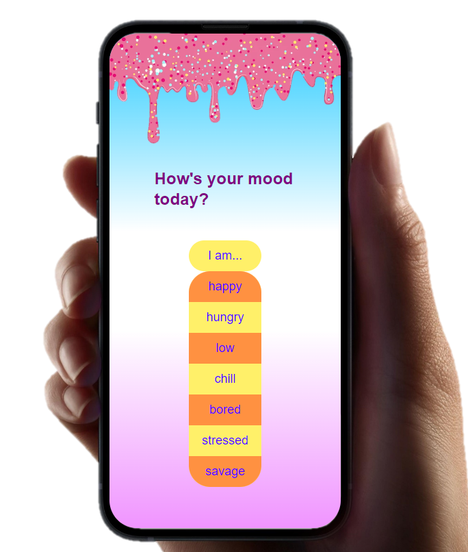
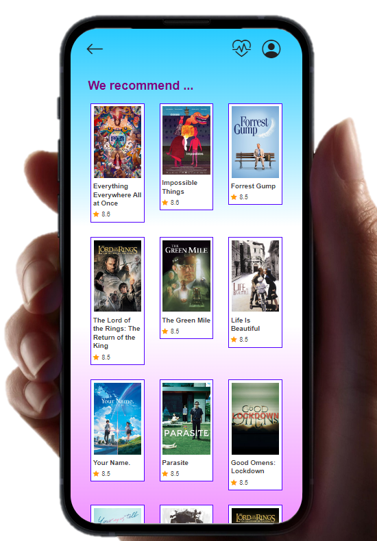
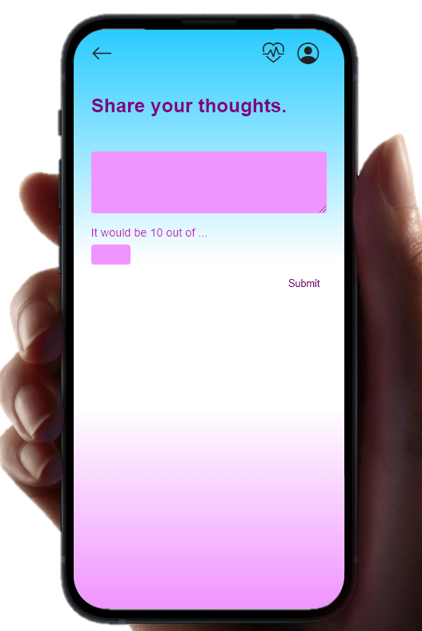
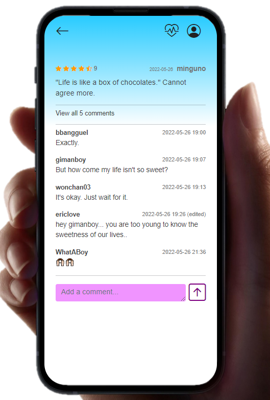
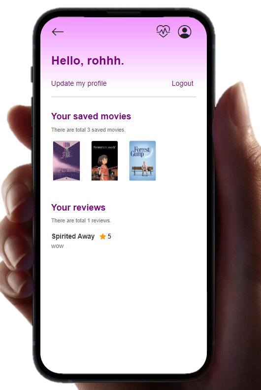

# MoodInside 

---

- 개발 기간: 2022.05.20 ~ 26

- 팀명: 희희호호

- 팀원 구성: 노희진(팀장), 명은호(팀원)

- 개발언어: HTML, CSS, Python

- 개발도구: VSCode, Google Chrome Browser, Bootstrap v5, Django 3.2+

- 목표:

  -  영화 데이터 기반 추천 서비스 구성 
  -   영화 추천 알고리즘 구성
  -  커뮤니티 서비스 구성 
  -  HTML, CSS, JavaScript, Vue.js, Django, REST API, Database 등을 활용한 실제 서비스 설계 
  -  서비스 관리 및 유지보수

  

--------

## 1) 역할 및 업무 분담


|  이름  |   역할   |                             내용                             |
| :----: | :------: | :----------------------------------------------------------: |
| 노희진 | 기획, BE | User Flow 기획, API 생성, DB, ERD, BE 전반 (회원가입, 로그인, 리뷰 및 댓글 CRUD) |
| 명은호 | 기획, FE |  UI 기획 및 디자인, 추천 알고리즘, FE 전반, 최종 오류 수정   |

----


## 2) 서비스 소개


### 1. 기획 의도: 

영화 시청 전 기분을 고려하는 사용자를 겨냥해, 기존에 없던 감정에 기반한 영화 장르를 추천해주는 서비스를 기획했습니다. 넷플릭스, 왓챠, 키노라이츠, 티빙 등 국내외 10개 OTT 서비스의 추천 알고리즘을 검토했습니다.

### 2. 콘셉트: 

미국 영화 리뷰 사이트 imdb를 오마주 해 영화에 대한 설명부터 회원가입 및 로그인, 리뷰, 댓글 작성 등을 모두 영어로 제작했습니다. 영화 리뷰와 시청 등 모바일로 주로 이루어진다는 특성을 고려해 모바일 버전만 기획했습니다. 


## 3) 목표 서비스 구현 내용


### 1. 추천 알고리즘

- normal: 왓챠, 네이버 영화에서 리뷰 크롤링 (beautifulsoup, selenium) 후 감성 키워드에 맞춰 리뷰에 해당 키워드가 언급된 영화들로 추천
- challenge: 리뷰 데이터를 토대로 감성 키워드를 선택하면 Word2vec을 통해 리뷰에 키워드와 유사한 단어들까지 포함해 제일 많이 언급된 영화들로 추천

### 2. 데이터 수집 및 가공

- 리뷰 크롤링 

  → 키워드 추출 

  → 불용어 사전 filtering 

  → 감성 키워드 추출 

  → 해당 키워드가 100개 미만 언급되있는 영화는 추천시스템 신뢰도를 위해 제외 (샘플 데이터 크기에 따라 달라질 것)

  → 영화별 감성 리뷰 키워드 할당됨!

### 3. 유저 간 팔로잉 및 팔로우

### 4. 소셜 로그인

### 5. 회원가입과 별개로 유저의 프로필 카테고리에 사진을 등록


---------------------

## 4) 실제 서비스 구현 내용

### 1. 추천 알고리즘

- 리뷰 키워드로 추천 알고리즘을 시도하려 했으나 장르와 감정을 엮어서 추천해주는 알고리즘을 작성

### 2. 데이터 수집 및 가공

- 네이버 영화 API에서 9443개의  리뷰 데이터, 현재 상영 영화 110개의 데이터를 추출했으나 사용하지 않기로 결정
- tmdb API를 사용하는 것으로 확정
- 출처가 다른 각각의 데이터를 수집 후 가공할 때의 어려움이 역량 밖이라고 느꼈음
- tmdb  get popular API를 통해 2978개의 데이터를 수집 
- 이 데이터를 기반으로 추천 알고리즘 생성

### 3. 유저 간 팔로잉 및 팔로우 기능 구현 포기

- 영화 추천 서비스와 사용자 맞춤 영화 저장 서비스에 초점을 두기 위해 이외의 기능은 과감히 포기

### 4. 소셜 로그인

- 필수 기능이 아니었으므로 구현 포기

### 5. 회원가입과 별개로 유저의 프로필 카테고리에 사진 등록

- Profile 모델을 별도로 만들어야 하는데 필수 기능 구현에 시간 투자하기 위해 구현 포기


-----------

## 4) ERD

1) accounts

```python
# accounts/models.py

from django.db import models
from django.contrib.auth.models import AbstractUser

# Create your models here.
class User(AbstractUser):
    followings = models.ManyToManyField('self', symmetrical=False, related_name='followers')
    nickname = models.CharField(null=True, max_length=10)
    image = models.ImageField(null=True, blank=True)

```

2. movies

```python
# movies/modles.py

from django.db import models
from django.conf import settings

# Create your models here.

class Mood(models.Model):
    status = models.CharField(max_length=10) #기분상태


class Movie(models.Model):
    title = models.CharField(max_length=100) #제목
    release_date = models.DateField(blank=True) #개봉일
    vote_average = models.FloatField(blank=True) #평점
    vote_count = models.IntegerField(blank=True)
    genres = models.CharField(max_length=50, blank=True) #장르
    mood = models.ManyToManyField(Mood, blank=True)
    description = models.TextField(blank=True) #줄거리
    poster_path = models.CharField(max_length=300, blank=True) #포스터 이미지 경로
    bookmark = models.ManyToManyField(settings.AUTH_USER_MODEL, blank=True, related_name='saved') #북마크영화


class Review(models.Model):
    movie = models.ForeignKey(Movie, on_delete=models.CASCADE)
    content = models.TextField()
    created_at = models.DateTimeField(auto_now_add=True)
    updated_at = models.DateTimeField(auto_now=True)
    user = models.ForeignKey(settings.AUTH_USER_MODEL, on_delete=models.CASCADE)
    score = models.IntegerField()
    like_users = models.ManyToManyField(settings.AUTH_USER_MODEL, related_name='like_reviews')


class Comment(models.Model):
    review = models.ForeignKey(Review, on_delete=models.CASCADE, related_name = 'comments')
    content = models.TextField()
    created_at = models.DateTimeField(auto_now_add=True)
    updated_at = models.DateTimeField(auto_now=True)
    user = models.ForeignKey(settings.AUTH_USER_MODEL, on_delete=models.CASCADE )
 
```


- 커뮤니티 카테고리를 따로 만들지 않고 영화별 리뷰 작성으로 구현
- Movie와 Review, Review와 Comment가 각각 1:N 의 관계로 구성
- Mood 모델은 선언해놓았으나 사용하지 않았다. (MoodForm도 생성해 choiceField로 감정을 선택하게 하려했으나 front 페이지에서 직접 감정을 지정해주는 방법을 사용)
- 리뷰에 좋아요 기능을 구현


----------

## 5) 주요 기능


### 1. 추천 알고리즘

	

```python
@login_required
@require_GET
def index(request, mood_pk):

    mood = {
        '1' : ['Comedy', 'Family', 'Fantasy', 'Romance'], 
        '2' : ['Family', 'Documentary', 'History'],
        '3' : ['Drama', 'History', 'Documentary'],
        '4' : ['Music', 'Tv Movie', 'Drama'],
        '5' : ['Action', 'Adventure', 'Mystery',],
        '6' : ['Action', 'Western', 'Fantasy'],
        '7' : ['Thriller', 'Crime', 'War', 'Horror']
    }

    # 보관함에 저장된 영화 목록
    personal = request.user.saved.all()

    # 리뷰를 쓴 영화 제외
    rest_movies = Movie.objects.exclude(review__user=request.user).order_by('-vote_average')

    data = []
    for movie in rest_movies:
        for genre in mood[f'{mood_pk}']:
            if personal.filter(pk=movie.pk).exists(): # 1) if
                continue
            if genre in movie.genres: # 2) if 
                if movie not in data: # 3) if
                    data.append(movie)
            if len(data) == 100:
                break
        if len(data) == 100:
            break

    saved = []
    for saved_movie in personal:
        if saved_movie in Movie.objects.filter(review__user=request.user):
            continue
        for genre in mood[f'{mood_pk}']:
            if genre in saved_movie.genres:
                if not saved_movie in saved:
                    saved.append(saved_movie)

    context = {
        'saved': saved,
        'data': data,
        'mood_pk': mood_pk,
    }

    return render(request, 'movies/index.html', context)
```

- 아직 평가를 하지 않은 영화들에 한해서 해당 기분에 알맞은 평균평점 톱 100위 영화를 추천하되, 아직 평가하지 않았지만 보관함에 따로 저장해둔 영화가 선택한 기분에 적합하다면 최상단에 보여지는 알고리즘을 구현
- 톱 100 추천 (data)
  1. Movie 테이블에서 사용자가 평가한 영화를 제외한 나머지 객체를 담은 QuerySet을 평점 내림차순으로 rest_movies에 저장
  2. 전달받은 mood_pk 값을 key값으로 해당되는 장르 호출
  3. ① if 문: 보관함에 저장된 영화는 제외 
  4. ② if 문: 사용자가 선택한 mood에 해당하는 장르의 영화이면 추천 리스트 data에 추가
  5. 100개의 데이터를 받았다면 반복문 종료
- 내 보관함 리스트 우선추천 (saved):
  1. 사용자가 보관함에 저장한 영화 QuerySet을 personal에 저장
  2. ③ if 문: 보관함에 저장한 영화 중 평가한 영화는 추천 리스트에서 제외
  3. ④ if 문: 사용자가 선택한 mood에 해당하는 장르의 영화가 보관함에 저장된 영화의 장르이면 추천 리스트 saved에 추가
- 리뷰 등록, 수정, 삭제 시 해당 영화의 평점과 총 리뷰 개수에 반영되어 평균평점에 기반한 톱 100순위 실시간 변동


### 2.  영화별 리뷰, 리뷰에 대한 댓글 작성 가능



#### 1) 영화 리뷰 작성 함수

```python

@login_required
def create(request, movie_pk):

    if request.method == 'POST':
        form = ReviewForm(request.POST)
        if form.is_valid():
            review = form.save(commit=False)

            review.user = request.user
            review.movie = Movie.objects.get(pk=movie_pk)

            movie = Movie.objects.get(pk=movie_pk)
            movie.vote_average = round((movie.vote_average * movie.vote_count + review.score) / (movie.vote_count + 1), 1)
            movie.vote_count += 1
            movie.save()

            review.save()

            return redirect('movies:detail', movie_pk)
    else:
        form = ReviewForm()
    
    context = {
        'form': form,
    }
    return render(request, 'movies/create.html', context)

```

- 리뷰 등록, 수정, 삭제 시 해당 영화의 평점과 총 리뷰 개수에 반영되어 평균평점에 기반한 톱 100순위 실시간 변동 로직이 포함되어 있음

  

#### 2) 영화 리뷰에 대한 댓글 작성, 조회 함수 



```python
@login_required
def read(request, review_pk):

    review = get_object_or_404(Review, pk=review_pk)
    if request.method == 'POST':
        comment_form = CommentForm(request.POST)
    
        if comment_form.is_valid():
            comment = comment_form.save(commit=False)
            comment.review = review
            comment.user = request.user
            comment.save()
            return redirect('movies:read', review.pk)
    else:
        comment_form = CommentForm()

    context = {
        'review': review,
        'review_pk': review_pk,
        'comment_form' : comment_form,
        'review' : review,
        'comments' : review.comments.all(),
    }
    return render(request, 'movies/read.html', context)

```

- 댓글 작성과 댓글 조회가 하나의 함수에 들어가 있음
- 영화 리뷰와 그에 대한 댓글을 한 페이지에 출력하다보니 종속성 문제가 발생
- 다른 함수에서는 한 함수당 하나의 기능만 처리하도록 수정


### 3. 리뷰와 댓글 모두 CRUD가 가능 

(코드 참조 안함)

### 4. 영화별 북마크가 가능



```python
@require_POST
def save(request, movie_pk):
    if request.user.is_authenticated:
        movie = get_object_or_404(Movie, pk=movie_pk)
        user = request.user

        response = {
            'saved': False,
            'text': 'Save this film',
            'count': 0,
        }

        if movie.bookmark.filter(pk=user.pk).exists():
            movie.bookmark.remove(user)
        else:
            movie.bookmark.add(user)
            response['saved'] = True
            response['text'] = 'Already saved'
            
        response['count'] = movie.bookmark.count()
        return JsonResponse(response)
    return redirect('accounts:login')

```

- 사용자가 저장하고싶은 영화면 저장 버튼을 클릭, 저장을 해제하고 싶으면 같은 아이콘을 클릭
- 비동기 처리로 화면을 이동하지 않음
- 사용자의 프로필 페이지에서 저장된 영화 목록과 저장 영화 개수를 확인 가능


### 5. 리뷰에 좋아요 누르기

```python
@login_required
@require_POST
def review_like(request, review_pk):

    if request.user.is_authenticated:
        review = get_object_or_404(Review, pk=review_pk)
        user = request.user

        response = {
            'liked': False,
            'count': 0,
        }

        if review.like_users.filter(pk=user.pk).exists():
            review.like_users.remove(user)

        else:
            review.like_users.add(user)
            response['liked'] = True

        response['count'] = format(review.like_users.count(), ',')

        return JsonResponse(response)
    return redirect('accounts:login')

```

- 비동기 처리로 화면 이동하지 않음


--------------

## 6) 회고 및 아쉬운 점

- ERD를 조금씩 수정해야 했음. DB를 갱신하는 것 자체는 문제가 되지 않으나 클린한 코드와 논리적 설계에서 조금의 아쉬움이 있었음

- 각 컴포넌트 및 함수끼리의 종속성을 최소화해야 하는데, 초기 코드에서는 그 부분이 실현되지 못했음. 이후 수정을 통해 최대한 분리함

- 추천 알고리즘 작성시 mood (감정) 딕셔너리에 7가지 감정들을 str 타입으로 수동으로 지정해주었음. 해당 함수인 index 함수에는 처음에 mood_pk, movie_pk 두 인자를 함께 넘겼음. 때문에 다른 함수에서 index로 redirect 되는 경우 중간에 필요 없어서 적어주지 않았던 mood_pk 를 넣어주지 못하는 문제가 발생. 예를 들어 index 외의 페이지에서 '뒤로 가기' 버튼을 만들고 렌더링할 때 mood_pk 와 관련이 없는 페이지에서는 index 로 가지 못했던 것.  따라서 각 함수당 ''전달 pk는 1개" 라는 룰을 만들어 url을 재작성했다. 

- ORM을 활용해 원하는 방식의 추천 알고리즘에 접근하는 부분에서 난관

- 뷰를 사용하지 않고 바닐라 자바스크립트로 구현하다보니 프론트와 백 사이 api랜더링 과정이 생략됐음. 

- 회원탈퇴를 모달창에서 직접 해결하기 위해 자바스크립트를 활용할 때 레이어가 많고, 비밀번호 확인 form에 대한 이해가 부족해서 validation 기능을 활용하지 못했음. 따라서 검정에 대한 코드를 직접 작성하고 수동으로 확인해줘야 했음. 모달창을 거치지 않고 장고로만 시도했을 땐 성공, 그러나 모달창을 거쳐 비동기 처리를 하려다보니 이런 문제가 발생 (질문 후 도움을 받아 해결)

- 뒤로가기 문제는  {{ request.META.HTTP_REFERER }} 를 써서 해결했지만, 브라우저에 저장된 데이터 기반으로 '해당 페이지 직전의 페이지' 로 렌더링 되는거라 연속 두번 뒤로가기가 불가능하다는 아쉬움이 있음


