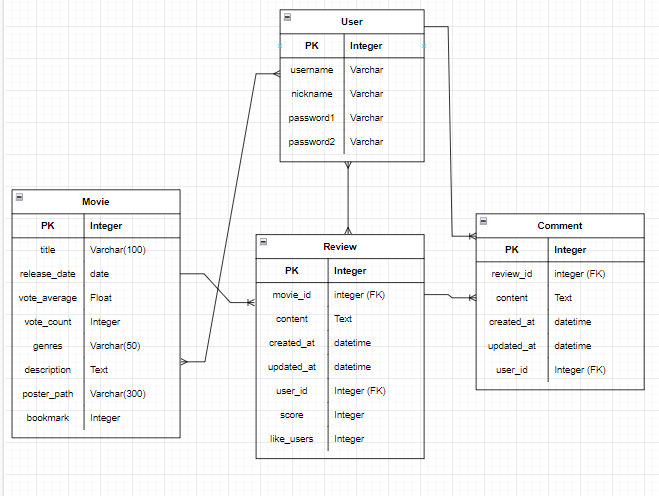

# MoodInside 

## 개발 기간

2022.05.22 ~ 05.26 (5일)

## 팀원 및 역할

팀명: 희희호호 (2명)

FrontEnd: 명은호

BackEnd: 노희진

## 기술 스택

FrontEnd: JavaScript, HTML, CSS

BackEnd: Python, Django, SQLite3

## 협업 툴

Git, Github, MatterMost, Notion, Discord

## 서비스 소개

- 사용자의 감정에 맞춰 장르를 추려내 영화를 추천해주는 서비스를 기획했습니다.
- 영화 리뷰 어플 왓챠피디아, 키노라이츠, 예매 어플 CGV, 메가박스 등 주로 모바일로 기획된 영화 관련 서비스를 참고해 'PC로 접속하는 모바일 어플' 컨셉으로 모바일 버전으로만 기획했습니다.
- tmdb 영화 사이트의 인기 영화 데이터 API를 활용했습니다.

## ERD

## 주요 기능

#### User

- 회원가입 시 비밀번호 유효성 검증 및 사용자 중복 검사
- 회원정보 수정 및 회원탈퇴 시 비밀번호 검증

#### Movie

- 사용자가 감정 선택 시 그 감정에 해당하는 장르 및 영화 추천 목록 조회
- 추천 영화 상세 정보
- 영화별 북마크

#### Review, Comment

- 리뷰 작성/조회/수정/삭제
- 댓글 작성/조회/수정/삭제
- 리뷰에 좋아요 누르기

## Demo

----

## 코드에 대하여

- FrontEnd: https://obtainable-cake-1bd.notion.site/FE-f6425e15064e464cb8f1a3af11af2791
- BackEnd: https://obtainable-cake-1bd.notion.site/BE-156b8ee518344178b6644ea1bbc925ec

## Resource

- 회의록 및 개발 상세 일정: https://obtainable-cake-1bd.notion.site/db8969968cd2460891f43a20d7e4645f

